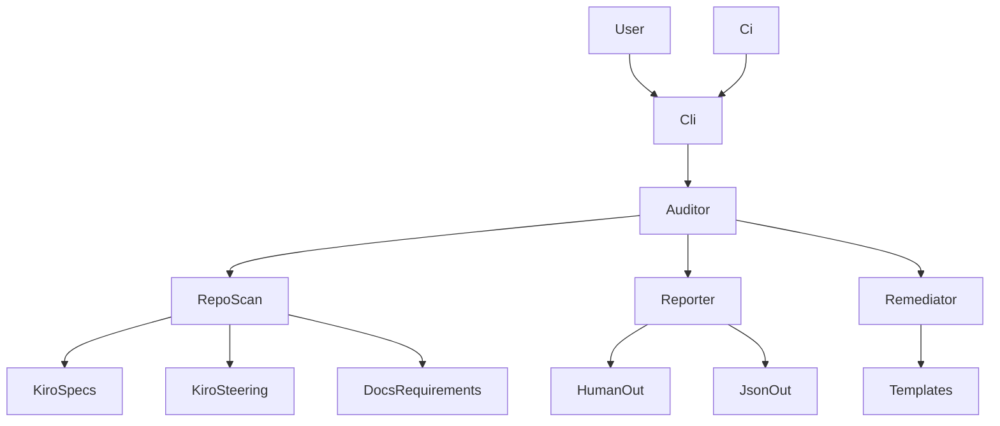
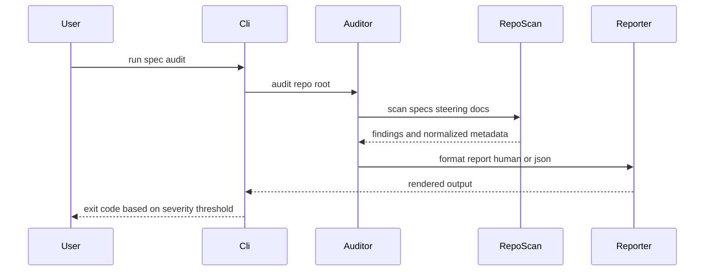

## Overview

**Purpose**: This feature delivers a repository audit capability to maintainers so they can detect missing or inconsistent Kiro spec artifacts, steering prerequisites, and traceability references, and optionally scaffold missing files safely.
**Users**: Maintainers and CI pipelines will utilize this to validate that `.kiro/specs/`, `.kiro/steering/`, and `docs/requirements.md` remain complete and coherent.
**Impact**: Adds a new CLI command under `pdf-grepper` and a small internal “maintenance” module for deterministic repository scanning and reporting.

### Goals
- Provide a deterministic audit of spec-driven development artifacts and traceability references.
- Produce both human-readable and machine-readable reports suitable for CI.
- Optionally scaffold missing files from templates without overwriting existing files.

### Non-Goals
- Enforcing semantic correctness of the product requirements (only structural completeness/consistency checks).
- Modifying existing specs in-place (including `spec.json` migrations); only non-destructive migration guidance is produced.
- Network-based checks (e.g., validating external links) or executing any repository code.

## Architecture

### Existing Architecture Analysis
- The project exposes a Typer-based CLI (`src/pdf_grepper/cli.py`) and is packaged via `pyproject.toml` entrypoint `pdf-grepper = "pdf_grepper.cli:app"`.
- Kiro artifacts live in `.kiro/specs/`, `.kiro/steering/`, and templates in `.kiro/settings/templates/`.
- The repository already contains multiple `spec.json` shapes (legacy vs template-initialized), so audit logic must tolerate and normalize multiple schemas.

### Architecture Pattern & Boundary Map

**Architecture Integration**:
- Selected pattern: “CLI + pure library core” (Option A) to keep repo scanning logic testable and independent from IO presentation.
- Domain/feature boundaries: `cli` (command wiring) vs `maintenance` (auditing/remediation logic) vs `reporting` (formatting/serialization).
- New components rationale: a small auditor core and report model are required; the existing pipeline is unrelated.
- Steering compliance: offline-safe, deterministic, and non-destructive by default.



### Technology Stack

| Layer | Choice / Version | Role in Feature | Notes |
|-------|------------------|-----------------|-------|
| CLI | Typer (existing) | Add `spec-audit` command | Reuse existing entrypoint |
| CLI output | Rich (existing) | Human-readable report rendering | Keep output stable/deterministic |
| Core | Python stdlib | Filesystem scanning, JSON parsing | No network |
| Runtime | Same as project | Runs locally and in CI | Must be offline-safe |

## System Flows



## Requirements Traceability

| Requirement | Summary | Components | Interfaces | Flows |
|-------------|---------|------------|------------|-------|
| 1.1 | Discover spec directories | Auditor, RepoScan | `audit` | Audit sequence |
| 1.2 | Read spec metadata | SpecJsonParser | `parse_spec_json` | Audit sequence |
| 1.3 | Report invalid specs | Auditor, FindingModel | `Finding` | Audit sequence |
| 1.4 | Report presence of key artifacts | RepoScan | `SpecArtifacts` | Audit sequence |
| 1.5 | Read-only default | Auditor | `AuditOptions` | Audit sequence |
| 2.1 | Validate initialized has requirements | Validator | `validate_spec` | Audit sequence |
| 2.2 | Validate headings exist | Validator | `validate_requirements_md` | Audit sequence |
| 2.3 | Validate design exists when needed | Validator | `validate_spec` | Audit sequence |
| 2.4 | Validate tasks exist when needed | Validator | `validate_spec` | Audit sequence |
| 2.5 | Detect schema mismatch and expected keys | SpecJsonParser, Validator | `SpecSchemaSupport` | Audit sequence |
| 3.1 | Required steering files exist | RepoScan, Validator | `validate_steering` | Audit sequence |
| 3.2 | Report missing steering files | Auditor, FindingModel | `Finding` | Audit sequence |
| 3.3 | Validate referenced paths exist | SteeringReferenceScanner | `extract_references` | Audit sequence |
| 3.4 | Validate docs requirements has matrix | DocsRequirementsValidator | `validate_traceability_matrix` | Audit sequence |
| 4.1 | Remediation creates missing files only | Remediator | `remediate` | Audit sequence |
| 4.2 | Refuse overwrite | Remediator | `RemediationPlan` | Audit sequence |
| 4.3 | Populate placeholders | Remediator | `TemplateRenderer` | Audit sequence |
| 4.4 | Provide non-destructive migration output | Reporter | `MigrationAdvice` | Audit sequence |
| 5.1 | Human summary grouped by spec and severity | Reporter | `render_human` | Audit sequence |
| 5.2 | Machine report with ids paths actions | Reporter | `render_json` | Audit sequence |
| 5.3 | Non-zero exit on missing required | Cli | exit code contract | Audit sequence |
| 5.4 | Zero exit when no above threshold | Cli | exit code contract | Audit sequence |
| 6.1 | No network required | Auditor | none | Audit sequence |
| 6.2 | Deterministic results | Auditor | ordering rules | Audit sequence |
| 6.3 | Read failures include path and reason | Auditor | error envelope | Audit sequence |
| 6.4 | Never execute repository code | Auditor | none | Audit sequence |

## Components and Interfaces

### Components Summary

| Component | Domain/Layer | Intent | Req Coverage | Key Dependencies (P0/P1) | Contracts |
|-----------|--------------|--------|--------------|--------------------------|-----------|
| `spec-audit` CLI command | CLI | Wire options, print report, set exit code | 5.3, 5.4 | Typer (P0), Reporter (P0) | Service, Batch |
| Spec Auditor core | Maintenance | Orchestrate scan, validate, remediate | 1.x, 2.x, 6.x | RepoScan (P0), Validator (P0) | Service |
| RepoScan | Maintenance | Enumerate files and basic presence | 1.1, 1.4, 3.1 | filesystem (P0) | Service |
| SpecJsonParser | Maintenance | Parse/normalize multiple `spec.json` schemas | 1.2, 2.5 | json (P0) | Service |
| Validator | Maintenance | Apply structural rules to scanned artifacts | 2.x, 3.1, 3.4 | regex (P1) | Service |
| SteeringReferenceScanner | Maintenance | Extract repository path references from steering files | 3.3 | markdown heuristics (P1) | Service |
| Remediator | Maintenance | Scaffold missing files without overwrite | 4.x | templates (P0) | Batch |
| Reporter | Reporting | Render human output and JSON output | 5.1, 5.2, 4.4 | Rich, json (P0) | Service |

### Maintenance

#### SpecAuditor

| Field | Detail |
|-------|--------|
| Intent | Deterministically audit repository spec artifacts and optionally remediate |
| Requirements | 1.1, 1.2, 1.3, 1.4, 1.5, 2.1, 2.2, 2.3, 2.4, 2.5, 6.1, 6.2, 6.3, 6.4 |

**Responsibilities & Constraints**
- Orchestrate scanning, validation, and report generation.
- Enforce deterministic ordering (sort by path, then stable finding id ordering).
- Enforce safety: default read-only; remediation is explicit.

**Dependencies**
- Inbound: CLI command — passes options and consumes report (P0)
- Outbound: RepoScan — enumerate artifacts (P0)
- Outbound: Validator — produce findings (P0)
- Outbound: Remediator — optional scaffolding (P1)
- Outbound: Reporter — output rendering/serialization (P0)

**Contracts**: Service [x] / API [ ] / Event [ ] / Batch [x] / State [ ]

##### Service Interface
```python
from dataclasses import dataclass
from enum import Enum
from typing import Any, Optional

class Severity(str, Enum):
    info = "info"
    warn = "warn"
    error = "error"

@dataclass(frozen=True)
class AuditOptions:
    repo_root: str
    remediation: bool
    output_format: str  # human or json
    output_path: Optional[str]
    severity_threshold: Severity

@dataclass(frozen=True)
class Finding:
    id: str
    severity: Severity
    message: str
    path: Optional[str]
    spec: Optional[str]
    recommended_action: Optional[str]

@dataclass(frozen=True)
class AuditReport:
    findings: list[Finding]
    summary: dict[str, Any]

class SpecAuditorService:
    def audit(self, opts: AuditOptions) -> AuditReport:
        """Preconditions: repo_root exists and is readable.
        Postconditions: report.findings is deterministic for the same repo state.
        """
        raise NotImplementedError
```

- Preconditions:
  - `repo_root` exists and is readable.
- Postconditions:
  - Findings are stable-ordered (deterministic).
  - No file modifications unless `remediation` is enabled.
- Invariants:
  - No network access.
  - No execution of repository code.

#### SpecJsonParser

| Field | Detail |
|-------|--------|
| Intent | Parse and normalize spec metadata from `spec.json` across supported schema variants |
| Requirements | 1.2, 2.5 |

**Responsibilities & Constraints**
- Support at least two schema “shapes” already present in the repository.
- Produce a normalized internal model used by validators.

**Schema support decision**
- If `spec.json` contains `feature_name`, treat as “current template schema”.
- Else if it contains `feature` and a `status` object, treat as “legacy schema”.
- Any other shape is a schema mismatch finding and includes expected keys for the supported schemas.

**Contracts**: Service [x] / API [ ] / Event [ ] / Batch [ ] / State [ ]

##### Service Interface
```python
from dataclasses import dataclass
from typing import Optional

@dataclass(frozen=True)
class NormalizedSpecMeta:
    feature_name: str
    phase: Optional[str]
    schema_kind: str  # current or legacy or unknown

class SpecJsonParserService:
    def parse_spec_json(self, path: str) -> NormalizedSpecMeta:
        """Preconditions: path exists.
        Postconditions: raises a parse error only for unreadable/invalid JSON; schema mismatches are reported as findings by the caller.
        """
        raise NotImplementedError
```

#### Reporter

| Field | Detail |
|-------|--------|
| Intent | Render findings and summary as human output or machine JSON |
| Requirements | 5.1, 5.2, 4.4 |

**Responsibilities & Constraints**
- Human output groups by spec then severity.
- Machine output contains stable finding IDs, paths, and recommended actions.

**Contracts**: Service [x] / API [ ] / Event [ ] / Batch [ ] / State [ ]

##### Service Interface
```python
from typing import Any

def render_human(report: AuditReport) -> str:
    raise NotImplementedError

def render_json(report: AuditReport) -> dict[str, Any]:
    raise NotImplementedError
```

## Data Models

### Domain Model
- **Finding**: atomic observation with stable id, severity, optional spec and path, and recommended action.
- **AuditReport**: deterministic list of findings plus summary metadata (counts, thresholds, scanned paths).
- **NormalizedSpecMeta**: internal view of spec metadata independent of source `spec.json` schema.
- **RemediationPlan**: list of safe creates (path + template + rendered content) and conflicts.

### Logical Data Model
- Findings are ordered by `(spec, severity_rank, id, path)`.
- Severity rank: `error` > `warn` > `info`.
- Machine output JSON includes:
  - `tool`: name and version
  - `repo_root`
  - `generated_at`
  - `severity_threshold`
  - `findings`: list of `{id, severity, message, path, spec, recommended_action}`
  - `summary`: counts

## Error Handling

### Error Strategy
- Fail fast on invalid CLI flags.
- Convert filesystem and parse failures into `error` findings that include path and reason.
- Keep scanning best-effort: one unreadable file should not prevent reporting other findings.

### Error Categories and Responses
- **User errors**: invalid `--format` or `--severity-threshold` → immediate CLI error with usage.
- **System errors**: unreadable files, JSON parse failures → error finding with path and reason.
- **Conflicts**: remediation overwrite attempt → error finding and refusal; no changes applied for that file.

## Testing Strategy

- Unit Tests:
  - Parser normalization for current and legacy `spec.json` shapes.
  - Validator checks: missing required steering files, missing spec artifacts, malformed requirements headings.
  - Reference extraction heuristics for steering path references (backticks and markdown links).
- Integration Tests:
  - Run `spec-audit` against a temporary repo fixture containing a small `.kiro/` layout.
  - Remediation mode creates files from templates without overwriting.
- E2E/CLI Tests:
  - Exit codes: non-zero when findings above threshold; zero otherwise.

## Optional Sections

### Security Considerations
- Treat repository contents as untrusted input.
- Do not execute repository code or shell out.
- Do not read secrets; only filesystem paths and markdown/json contents.

### Performance & Scalability
- Repository scan is O(number of files checked) and should remain fast; avoid deep traversal beyond `.kiro/` and `docs/requirements.md`.
- Deterministic ordering requires sorting; bound by number of findings.
