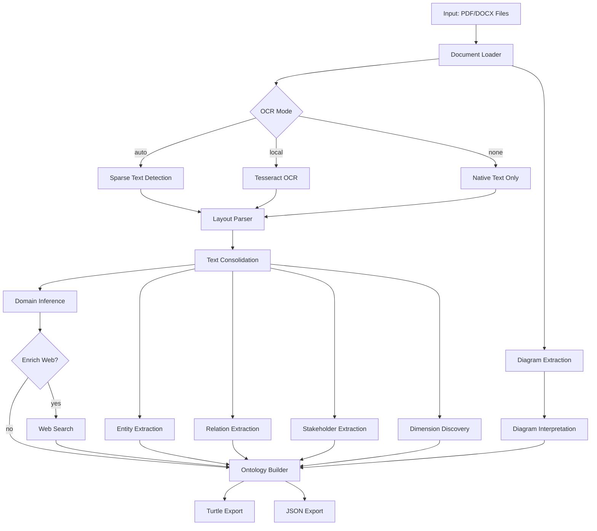

# Design Document

## Overview

The PDF Intelligence System is a modular document processing pipeline that transforms unstructured PDF documents into structured RDF ontologies. The system follows a local-first architecture with optional cloud enhancement, ensuring users can operate offline while benefiting from cloud services when available.

The core architecture consists of:
1. **Document Ingestion Layer** - Loads PDFs and DOCX files with multi-format support
2. **OCR Layer** - Adaptive text extraction using local Tesseract and optional cloud services
3. **Layout Analysis Layer** - Spatial parsing of document structure
4. **Information Extraction Layer** - NLP-based entity, relation, and stakeholder extraction
5. **Diagram Processing Layer** - Vector graphics interpretation for flowcharts and diagrams
6. **Domain Analysis Layer** - TF-IDF based domain inference and dimension discovery
7. **Enrichment Layer** - Optional web search and cloud-based enhancement
8. **Export Layer** - RDF ontology serialization with provenance

## Architecture

### High-Level Pipeline Flow



### Component Architecture

The system uses a modular design with clear separation of concerns:

- **pdf_grepper.pdf**: Document loading, layout parsing, OCR orchestration
- **pdf_grepper.ie**: Information extraction (entities, relations, stakeholders)
- **pdf_grepper.diagrams**: Diagram primitive extraction and interpretation
- **pdf_grepper.dimensions**: Business dimension discovery
- **pdf_grepper.cloud**: Cloud adapter interfaces (OpenAI, Google, AWS, Azure)
- **pdf_grepper.enrich**: Web enrichment services
- **pdf_grepper.ontology**: RDF model and Turtle serialization
- **pdf_grepper.cli**: Command-line interface and configuration
- **pdf_grepper.pipeline**: Main orchestration logic

## Components and Interfaces

### Document Loader (`pdf_grepper.pdf.loader`)

**Responsibility**: Load PDF and DOCX files, extract pages and initial text content

**Interface**:
```python
def load_pdf_or_docx(
    input_paths: List[str],
    ocr_mode: str = "auto"
) -> DocumentModel
```

**Behavior**:
- Accepts multiple input paths for multi-source fusion
- Returns DocumentModel with pages, text blocks, and source provenance
- Handles both native PDFs (PyMuPDF) and DOCX files (python-docx)
- Delegates OCR decisions to OCR module based on mode

### OCR Module (`pdf_grepper.pdf.ocr`)

**Responsibility**: Perform optical character recognition on page images

**Interface**:
```python
def ocr_image_to_text(
    image: Image.Image,
    lang: str = "eng"
) -> Optional[str]
```

**Behavior**:
- Uses Tesseract with configurable language
- Returns None on failure (graceful degradation)
- Applies PSM 3 (automatic page segmentation) and OEM 1 (LSTM neural net)

### Layout Parser (`pdf_grepper.pdf.layout`)

**Responsibility**: Extract spatial structure and text blocks with coordinates

**Interface**:
```python
def consolidate_text(page: Page) -> List[str]
```

**Behavior**:
- Extracts text blocks from Page objects
- Preserves bounding box coordinates in SourceSpan
- Returns consolidated text for downstream NLP

### Entity Extractor (`pdf_grepper.ie.entities`)

**Responsibility**: Extract named entities using NLP

**Interface**:
```python
def extract_entities(
    texts: List[Tuple[str, Optional[SourceSpan]]]
) -> List[Entity]
```

**Behavior**:
- Primary: Uses spaCy NER for PERSON, ORG, GPE, PRODUCT, FAC, LOC, EVENT
- Fallback: Regex-based capitalized noun phrase extraction as CONCEPT
- Deduplicates entities by normalized text
- Assigns unique UUIDs and preserves source spans

### Relation Extractor (`pdf_grepper.ie.relations`)

**Responsibility**: Extract semantic relations between entities

**Interface**:
```python
def extract_relations(
    entities: List[Entity],
    texts: List[Tuple[str, Optional[SourceSpan]]]
) -> List[Relation]
```

**Behavior**:
- Pattern-based extraction: "X uses Y", "X depends on Y", "X integrates with Y", "X is part of Y"
- Maps predicates to RDF properties (pg:uses, pg:dependsOn, pg:integratesWith, pg:isPartOf)
- Validates entity references exist
- Assigns confidence scores (0.5 for pattern-based)

### Stakeholder Extractor (`pdf_grepper.ie.stakeholders`)

**Responsibility**: Identify actors and their perspectives

**Interface**:
```python
def extract_stakeholders(
    texts: List[Tuple[str, Optional[SourceSpan]]]
) -> List[StakeholderPerspective]
```

**Behavior**:
- Identifies actor references and associated claims
- Records actor name, claim text, and source span
- Assigns confidence scores

### Diagram Extractor (`pdf_grepper.diagrams.extract`)

**Responsibility**: Extract vector graphics primitives from PDF pages

**Interface**:
```python
def extract_diagram_primitives(
    doc_path: str,
    page_obj: fitz.Page,
    page: Page
) -> None
```

**Behavior**:
- Uses PyMuPDF drawing API to extract rectangles and lines
- Creates DiagramNode for rectangles with bounding boxes
- Creates DiagramEdge for lines (undirected by default)
- Mutates Page object in-place

### Diagram Interpreter (`pdf_grepper.diagrams.interpret`)

**Responsibility**: Interpret diagram primitives as semantic nodes and edges

**Interface**:
```python
def interpret_diagram(page: Page) -> None
```

**Behavior**:
- Associates text labels with diagram nodes
- Infers node types (process, entity, decision) from shape properties
- Determines edge directionality from arrow markers
- Mutates Page object in-place

### Dimension Discovery (`pdf_grepper.dimensions.discover`)

**Responsibility**: Extract business and technical dimensions

**Interface**:
```python
def discover_dimensions(
    texts: List[Tuple[str, Optional[SourceSpan]]]
) -> List[Dimension]
```

**Behavior**:
- Pattern matching for dimension keywords (latency, throughput, cost, performance, etc.)
- Extracts associated numeric values and units
- Assigns unique UUIDs and confidence scores

### Domain Inference (in `pdf_grepper.pipeline`)

**Responsibility**: Compute domain labels using TF-IDF

**Implementation**:
```python
def _infer_domain_labels(
    pages: List[Page],
    top_k: int = 8
) -> List[str]
```

**Behavior**:
- Consolidates text from all pages
- Applies TF-IDF with max 256 features, English stop words, unigrams and bigrams
- Returns top 8 terms by TF-IDF score
- Filters to alphanumeric tokens with hyphens

### Cloud Adapters (`pdf_grepper.cloud.*`)

**Responsibility**: Interface with external cloud services

**Modules**:
- `openai_ie.py`: OpenAI GPT-based entity/relation refinement
- `google_vision.py`: Google Cloud Vision OCR
- `aws_textract.py`: AWS Textract document analysis
- `azure_read.py`: Azure Computer Vision Read API

**Common Interface Pattern**:
```python
def available() -> bool
    # Check if credentials are configured

def refine_entities_relations(
    entities: List[Entity],
    texts: List[Tuple[str, Optional[SourceSpan]]]
) -> Tuple[List[Entity], List[Relation]]
```

**Behavior**:
- Check environment variables for credentials
- Return unchanged inputs if unavailable (graceful degradation)
- Raise configuration errors only when explicitly invoked

### Web Enrichment (`pdf_grepper.enrich.web_search`)

**Responsibility**: Augment domain labels with external knowledge

**Interface**:
```python
def enrich_terms(
    terms: List[str],
    offline: bool = False
) -> Dict[str, List[str]]
```

**Behavior**:
- Queries DuckDuckGo and Wikipedia for each term
- Returns dictionary mapping terms to result snippets
- Respects offline flag (returns empty dict)

### Ontology Model (`pdf_grepper.ontology.model`)

**Responsibility**: Define RDF vocabulary and namespace management

**Interface**:
```python
def make_graph(base_uri: str) -> Tuple[Graph, Context]
```

**Behavior**:
- Creates rdflib Graph with custom namespace bindings
- Defines pg: namespace for pdf-grepper vocabulary
- Defines dom: namespace for domain-specific types
- Returns graph and context object with namespace accessors

### Ontology Exporter (`pdf_grepper.ontology.export_ttl`)

**Responsibility**: Serialize DocumentModel to RDF Turtle

**Interface**:
```python
def export_turtle(
    model: DocumentModel,
    ttl_path: str,
    base_uri: str = "http://example.org/pdf-grepper/"
) -> Graph
```

**Behavior**:
- Creates URIs for all model elements (documents, pages, entities, relations, etc.)
- Adds RDF triples with types, labels, and properties
- Includes provenance metadata (source paths, page indices, bounding boxes)
- Uses standard vocabularies: RDF, RDFS, DCTERMS, XSD
- Serializes to Turtle format at specified path

### CLI (`pdf_grepper.cli`)

**Responsibility**: Command-line interface and argument parsing

**Interface**:
```python
@app.command("parse")
def parse_command(
    inputs: list[str],
    out: str = "model.ttl",
    json_out: Optional[str] = None,
    ocr: str = "auto",
    cloud: str = "",
    enrich_web: bool = False,
    offline: bool = False,
    base_uri: str = "http://example.org/pdf-grepper/"
) -> None
```

**Behavior**:
- Uses Typer for CLI framework
- Parses comma-separated cloud adapter list
- Invokes run_pipeline with parsed configuration
- Prints status messages using Rich formatting

### Pipeline Orchestrator (`pdf_grepper.pipeline`)

**Responsibility**: Coordinate all processing steps

**Interface**:
```python
def run_pipeline(
    input_paths: List[str],
    ttl_out: str,
    json_out: Optional[str] = None,
    ocr_mode: str = "auto",
    use_cloud: List[str] | None = None,
    enrich_web: bool = False,
    offline: bool = False,
    base_uri: str = "http://example.org/pdf-grepper/"
) -> DocumentModel
```

**Behavior**:
1. Load documents via loader
2. Extract diagram primitives from PDF pages
3. Interpret diagrams
4. Extract entities, relations, stakeholders
5. Optionally refine with cloud adapters
6. Discover dimensions
7. Infer domain labels
8. Optionally enrich with web search
9. Assemble complete DocumentModel
10. Export to Turtle and optionally JSON
11. Return DocumentModel

## Data Models

### Core Types (`pdf_grepper.types`)

**SourceSpan**: Provenance metadata
```python
@dataclass
class SourceSpan:
    page_index: Optional[int]
    bbox: Optional[Tuple[float, float, float, float]]  # x0, y0, x1, y1
    source_path: Optional[str]
    note: Optional[str]
```

**TextSpan**: Text with provenance
```python
@dataclass
class TextSpan:
    text: str
    span: Optional[SourceSpan]
    confidence: Optional[float]
```

**Entity**: Named entity
```python
@dataclass
class Entity:
    id: str  # UUID
    text: str
    label: str  # PERSON, ORG, GPE, PRODUCT, FAC, LOC, EVENT, CONCEPT
    span: Optional[SourceSpan]
    confidence: Optional[float]
    domain_type: Optional[str]  # e.g., dom:Service
```

**Relation**: Semantic relation between entities
```python
@dataclass
class Relation:
    id: str  # UUID
    subject_id: str  # Entity ID
    predicate: str  # e.g., pg:uses, pg:dependsOn
    object_id: str  # Entity ID
    span: Optional[SourceSpan]
    confidence: Optional[float]
```

**StakeholderPerspective**: Actor and claim
```python
@dataclass
class StakeholderPerspective:
    id: str  # UUID
    actor: str
    claim: str
    span: Optional[SourceSpan]
    confidence: Optional[float]
```

**Dimension**: Measurable attribute
```python
@dataclass
class Dimension:
    id: str  # UUID
    name: str  # e.g., "latency", "throughput"
    value: Optional[str]  # e.g., "100 ms"
    unit: Optional[str]
    span: Optional[SourceSpan]
    confidence: Optional[float]
```

**DiagramNode**: Diagram node
```python
@dataclass
class DiagramNode:
    id: str  # UUID
    label: Optional[str]
    span: Optional[SourceSpan]
    kind: Optional[str]  # "process", "entity", "decision"
```

**DiagramEdge**: Diagram edge
```python
@dataclass
class DiagramEdge:
    id: str  # UUID
    source: str  # Node ID
    target: str  # Node ID
    label: Optional[str]
    span: Optional[SourceSpan]
    directed: bool
```

**Page**: Document page
```python
@dataclass
class Page:
    index: int
    text_blocks: List[TextSpan]
    tables: List[List[TableCell]]
    figures: List[Figure]
    diagram_nodes: List[DiagramNode]
    diagram_edges: List[DiagramEdge]
```

**DocumentModel**: Complete document representation
```python
@dataclass
class DocumentModel:
    sources: List[str]
    title: Optional[str]
    pages: List[Page]
    entities: List[Entity]
    relations: List[Relation]
    stakeholders: List[StakeholderPerspective]
    dimensions: List[Dimension]
    domain_labels: List[str]
    extra_metadata: Dict[str, str]
```


## Correctness Properties

*A property is a characteristic or behavior that should hold true across all valid executions of a system-essentially, a formal statement about what the system should do. Properties serve as the bridge between human-readable specifications and machine-verifiable correctness guarantees.*

### Property 1: PDF loading preserves page structure
*For any* valid PDF file, loading the PDF should produce a DocumentModel with page count equal to the PDF's page count and each page should contain extractable content.
**Validates: Requirements 1.1**

### Property 2: Multi-file provenance tracking
*For any* set of input files, processing should produce results where every extracted element (entity, relation, text span) has a source_path that matches one of the input file paths.
**Validates: Requirements 1.3**

### Property 3: Invalid file error reporting
*For any* corrupted or invalid PDF file, attempting to load should raise an exception or return an error that includes the file path.
**Validates: Requirements 1.4**

### Property 4: Auto OCR triggers on sparse text
*For any* page with text density below threshold, when OCR mode is "auto", OCR should be performed on that page.
**Validates: Requirements 2.1**

### Property 5: Local OCR mode universality
*For any* set of pages, when OCR mode is "local", OCR should be invoked for every page regardless of text density.
**Validates: Requirements 2.2**

### Property 6: None OCR mode skips processing
*For any* set of pages, when OCR mode is "none", no OCR invocations should occur.
**Validates: Requirements 2.3**

### Property 7: OCR confidence inclusion
*For any* text extracted via OCR, the resulting TextSpan should include a confidence score (non-None value).
**Validates: Requirements 2.5**

### Property 8: Offline mode prevents cloud calls
*For any* configuration with offline=True, no cloud adapter functions should be invoked regardless of cloud adapter list.
**Validates: Requirements 3.4, 17.1**

### Property 9: Cloud adapter graceful degradation
*For any* cloud adapter that fails or raises an exception, processing should continue and produce results using local extraction only.
**Validates: Requirements 3.5**

### Property 10: Layout parsing includes bounding boxes
*For any* PDF page with text blocks, all extracted TextSpan objects should have SourceSpan with non-None bbox coordinates.
**Validates: Requirements 4.1, 4.2**

### Property 11: Reading order preservation
*For any* page with multiple text blocks, blocks should be ordered by vertical position (top to bottom) then horizontal position (left to right).
**Validates: Requirements 4.3**

### Property 12: Layout parsing resilience
*For any* page where layout parsing fails, processing should continue with remaining pages and not terminate the pipeline.
**Validates: Requirements 4.4**

### Property 13: Entity extraction invocation
*For any* document with non-empty text, entity extraction should produce at least one entity or return an empty list (not None).
**Validates: Requirements 5.1**

### Property 14: Entity unique identifiers
*For any* set of extracted entities, all entity IDs should be unique (no duplicates).
**Validates: Requirements 5.4**

### Property 15: Entity deduplication
*For any* text containing duplicate entity mentions (same normalized text), the extracted entity list should contain only one entity per unique normalized text.
**Validates: Requirements 5.5**

### Property 16: Relation structure completeness
*For any* extracted relation, it should have non-None values for id, subject_id, predicate, and object_id.
**Validates: Requirements 6.2**

### Property 17: Relation unique identifiers
*For any* set of extracted relations, all relation IDs should be unique (no duplicates).
**Validates: Requirements 6.3**

### Property 18: Stakeholder structure completeness
*For any* extracted stakeholder, it should have non-None values for id, actor, and claim.
**Validates: Requirements 7.2**

### Property 19: Stakeholder unique identifiers
*For any* set of extracted stakeholders, all stakeholder IDs should be unique (no duplicates).
**Validates: Requirements 7.3**

### Property 20: Diagram node structure completeness
*For any* extracted diagram node, it should have non-None values for id and span with bounding box coordinates.
**Validates: Requirements 8.3**

### Property 21: Diagram edge structure completeness
*For any* extracted diagram edge, it should have non-None values for id, source, target, and directed flag.
**Validates: Requirements 8.4**

### Property 22: Diagram processing resilience
*For any* page where diagram interpretation fails, processing should continue with remaining pages and not terminate the pipeline.
**Validates: Requirements 8.5**

### Property 23: Dimension structure completeness
*For any* extracted dimension, it should have non-None values for id and name.
**Validates: Requirements 9.3, 9.4**

### Property 24: Domain label stop word filtering
*For any* document, extracted domain labels should not contain common English stop words (the, and, or, is, etc.).
**Validates: Requirements 10.3**

### Property 25: Domain label count limit
*For any* document, the number of extracted domain labels should be at most 8.
**Validates: Requirements 10.4**

### Property 26: Offline mode skips web enrichment
*For any* configuration with offline=True, web enrichment functions should not be invoked regardless of enrich_web flag.
**Validates: Requirements 11.2, 17.2**

### Property 27: Web enrichment metadata recording
*For any* successful web enrichment, the DocumentModel extra_metadata should contain an "enrichment_counts" entry.
**Validates: Requirements 11.3**

### Property 28: Web enrichment resilience
*For any* web enrichment failure, processing should continue and produce results without enrichment data.
**Validates: Requirements 11.4**

### Property 29: Turtle export round-trip consistency
*For any* DocumentModel, exporting to Turtle then parsing the Turtle should preserve all entity IDs, relation IDs, and provenance metadata.
**Validates: Requirements 12.1**

### Property 30: Turtle URI generation completeness
*For any* DocumentModel with entities, relations, stakeholders, dimensions, and diagram elements, the exported Turtle should contain URIs for all elements.
**Validates: Requirements 12.2**

### Property 31: Turtle provenance inclusion
*For any* DocumentModel element with a SourceSpan, the exported Turtle should include triples for source_path, page_index, and bbox coordinates.
**Validates: Requirements 12.3**

### Property 32: Turtle vocabulary compliance
*For any* exported Turtle file, it should contain namespace declarations for rdf, rdfs, dcterms, and xsd.
**Validates: Requirements 12.4**

### Property 33: Turtle file creation
*For any* specified output path, after export_turtle completes, a file should exist at that path and be readable as valid Turtle syntax.
**Validates: Requirements 12.5**

### Property 34: JSON export round-trip consistency
*For any* DocumentModel, exporting to JSON then parsing the JSON should preserve all entities, relations, stakeholders, dimensions, pages, and diagrams.
**Validates: Requirements 13.1**

### Property 35: JSON completeness
*For any* DocumentModel with entities, relations, stakeholders, dimensions, and pages, the exported JSON should contain all these elements as top-level keys.
**Validates: Requirements 13.2**

### Property 36: JSON file creation
*For any* specified JSON output path, after export completes, a file should exist at that path and be readable as valid JSON.
**Validates: Requirements 13.3**

### Property 37: Cache write and read consistency
*For any* input file, when caching is enabled, processing twice should produce identical results with the second run using cached data.
**Validates: Requirements 16.1, 16.2**

### Property 38: Cache provenance metadata
*For any* cached result, the provenance metadata should indicate the result came from cache (e.g., note field contains "cache").
**Validates: Requirements 16.3**

### Property 39: Offline mode completeness
*For any* document, when offline mode is enabled with all local dependencies available, processing should complete successfully without network calls.
**Validates: Requirements 17.3**

### Property 40: Pipeline logging invocation
*For any* pipeline execution, log messages should be emitted for major steps (loading, OCR, entity extraction, export).
**Validates: Requirements 19.1**

### Property 41: Error logging with context
*For any* error that occurs during processing, a log message should be emitted containing the error type and contextual information.
**Validates: Requirements 19.3**

### Property 42: Output path logging
*For any* successful export, log messages should include the output file paths for Turtle and JSON files.
**Validates: Requirements 19.4**

### Property 43: Deterministic offline processing
*For any* document, running the pipeline twice in offline mode with identical configuration should produce byte-identical Turtle output.
**Validates: Requirements 20.1, 20.2**

## Error Handling

### Error Categories

**1. Input Errors**
- Invalid file paths: Report clear error with path and reason
- Corrupted PDFs: Log error, skip file, continue with remaining files
- Missing files: Report error immediately before processing

**2. Dependency Errors**
- Missing Tesseract: Report error when local OCR is required
- Missing spaCy models: Fall back to regex-based extraction
- Missing cloud credentials: Skip cloud adapters, use local processing

**3. Processing Errors**
- Layout parsing failures: Log warning, continue with remaining pages
- Entity extraction failures: Return empty list, continue processing
- Diagram interpretation failures: Log warning, continue processing
- OCR failures: Fall back to native text extraction

**4. Export Errors**
- File write failures: Report error with path and reason
- Invalid output paths: Report error before processing
- Serialization errors: Report error with model state information

### Error Handling Principles

1. **Graceful Degradation**: System should continue processing when optional components fail
2. **Clear Error Messages**: All errors should include context (file paths, step names, reasons)
3. **Fail Fast for Critical Errors**: Stop immediately for invalid inputs or missing required dependencies
4. **Logging**: All errors should be logged with appropriate severity levels
5. **No Silent Failures**: Every error should be either reported to user or logged

### Recovery Strategies

- **Cloud Adapter Failures**: Fall back to local processing
- **OCR Failures**: Use native text extraction
- **NLP Failures**: Use regex-based fallbacks
- **Partial Page Failures**: Continue with remaining pages
- **Enrichment Failures**: Continue with local results only

## Testing Strategy

### Unit Testing

The system will use pytest for unit testing with the following coverage:

**Core Module Tests**:
- `test_loader.py`: PDF and DOCX loading, multi-file handling
- `test_ocr_mode.py`: OCR mode selection logic (auto, local, none)
- `test_layout.py`: Layout parsing and text consolidation
- `test_entities.py`: Entity extraction with spaCy and regex fallback
- `test_relations.py`: Relation pattern matching and entity linking
- `test_stakeholders.py`: Stakeholder extraction
- `test_diagrams.py`: Diagram primitive extraction and interpretation
- `test_dimensions.py`: Dimension discovery and parsing
- `test_export.py`: Turtle and JSON serialization
- `test_cli_flags.py`: CLI argument parsing
- `test_offline.py`: Offline mode behavior with mocked network
- `test_cache.py`: Cache write and read operations
- `test_logging.py`: Log message emission

**Edge Cases**:
- Empty PDFs (no pages)
- PDFs with no text (pure images)
- Scanned PDFs with poor quality
- Very large PDFs (100+ pages)
- Malformed DOCX files
- Missing environment variables
- Invalid cloud credentials
- Network timeouts
- Disk full scenarios

### Property-Based Testing

The system will use Hypothesis for property-based testing in Python. Each property-based test will run a minimum of 100 iterations to ensure comprehensive coverage.

**Property Testing Library**: Hypothesis (Python)

**Test Configuration**:
```python
from hypothesis import given, settings
import hypothesis.strategies as st

@settings(max_examples=100)
@given(pdf_file=st.pdf_documents())
def test_property(pdf_file):
    # Test implementation
    pass
```

**Property Test Tagging**: Each property-based test will include a comment explicitly referencing the correctness property:
```python
# Feature: pdf-intelligence-system, Property 1: PDF loading preserves page structure
```

**Property Test Coverage**:
- Properties 1-43 as defined in Correctness Properties section
- Each property will be implemented as a single property-based test
- Tests will use custom Hypothesis strategies for generating PDFs, text, entities, etc.

### Integration Testing

**End-to-End Pipeline Tests**:
- Full pipeline execution with sample PDFs
- Multi-file processing with provenance verification
- Cloud adapter integration (with mocked APIs)
- Offline mode end-to-end flow
- Cache behavior across multiple runs

**Test Fixtures**:
- Sample PDFs (native and scanned)
- Sample DOCX files
- Expected output Turtle files
- Expected output JSON files
- Mock cloud API responses

### Test Data

**Corpus**:
- 10 sample PDFs covering various document types (reports, diagrams, forms)
- 5 scanned PDFs with varying quality
- 3 DOCX files as OCR variants
- Corrupted/invalid files for error testing

**Synthetic Data**:
- Generated PDFs with known entity/relation patterns
- Programmatically created diagrams with known structure
- Text with controlled entity density for testing extraction

### Continuous Testing

- All tests run on every commit
- Property-based tests run with 100 iterations in CI
- Integration tests run against sample corpus
- Performance benchmarks tracked over time

## Implementation Notes

### Dependencies

**Core Dependencies**:
- PyMuPDF (fitz): PDF parsing and rendering
- Tesseract/pytesseract: Local OCR
- spaCy: NLP and entity extraction
- rdflib: RDF graph construction and Turtle serialization
- scikit-learn: TF-IDF computation
- OpenCV: Image processing for diagrams
- Typer: CLI framework
- Pydantic: Data validation

**Optional Dependencies**:
- openai: OpenAI GPT integration
- google-cloud-vision: Google Vision OCR
- boto3: AWS Textract integration
- azure-ai-formrecognizer: Azure Read API
- duckduckgo-search: Web enrichment
- wikipedia-api: Web enrichment

### Performance Considerations

1. **Lazy Loading**: Load pages on-demand for large PDFs
2. **Caching**: Cache OCR results and entity extractions
3. **Parallel Processing**: Process pages in parallel where possible
4. **Memory Management**: Stream large files instead of loading entirely into memory
5. **Batch Processing**: Batch cloud API calls to reduce latency

### Security Considerations

1. **Credential Management**: Use environment variables, never hardcode
2. **Input Validation**: Validate file paths and prevent directory traversal
3. **Sandboxing**: Consider sandboxing PDF parsing to prevent malicious PDFs
4. **API Rate Limiting**: Implement rate limiting for cloud APIs
5. **Data Privacy**: Ensure sensitive documents are not logged or cached insecurely

### Extensibility Points

1. **Cloud Adapters**: Implement new adapters by following existing interface pattern
2. **Enrichment Sources**: Add new enrichment modules in `pdf_grepper.enrich`
3. **Export Formats**: Add new exporters in `pdf_grepper.ontology`
4. **Entity Types**: Extend entity labels in `pdf_grepper.ie.entities`
5. **Relation Patterns**: Add new relation patterns in `pdf_grepper.ie.relations`

### Future Enhancements

1. **Table Extraction**: Structured table recovery and CSV export
2. **Advanced Diagram Analysis**: Swimlane detection, chart axis extraction
3. **Schema Mapping**: Automatic mapping to schema.org and PROV-O
4. **Multi-Language Support**: Extend beyond English
5. **Incremental Processing**: Update ontology for document changes
6. **Query Interface**: SPARQL endpoint for ontology queries
